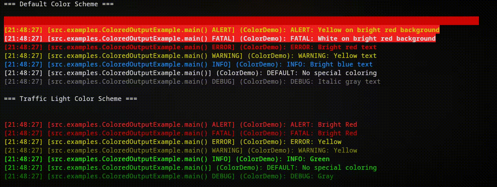

# JLogger

A lightweight, flexible Java logging library with ANSI color support, multiple output handlers, and customizable formatters.



## ✨ Features

- **8 Log Levels** — EMERGENCY, ALERT, FATAL, ERROR, WARNING, INFO, DEFAULT, DEBUG
- **ANSI Color Support** — Colorized console output with customizable color schemes
- **Multiple Handlers** — Console (SyslogHandler), File (FileStreamHandler)
- **Flexible Formatters** — Plain text, colored, and JSON output
- **Processors** — Transform log records before output (add metadata, filter, etc.)
- **Channel-based Logging** — Organize logs by named channels
- **Handler Bubbling** — Route logs through multiple handlers
- **Exception Logging** — Direct Throwable logging with stack traces
- **Message Formatting** — Printf-style format strings with arguments
- **Class Context** — Automatic labeling with originating class name

## 📋 Requirements

- **Java 11** or higher
- **Maven 3.x** for building

## 📦 Installation

### Maven (GitHub Packages)

Add the GitHub Package Registry to your `pom.xml`:

```xml
<repositories>
    <repository>
        <id>github</id>
        <url>https://maven.pkg.github.com/Nebalus/JLogger</url>
    </repository>
</repositories>

<dependencies>
    <dependency>
        <groupId>dev.nebalus.library</groupId>
        <artifactId>jlogger</artifactId>
        <version>1.0.0</version>
    </dependency>
</dependencies>
```

### Manual Installation

Clone and install locally:

```bash
git clone https://github.com/Nebalus/JLogger.git
cd JLogger
mvn install
```

## 🚀 Quick Start

```java
import dev.nebalus.library.jlogger.Logger;
import dev.nebalus.library.jlogger.LogLevel;
import dev.nebalus.library.jlogger.handler.SyslogHandler;

public class App {
    public static void main(String[] args) {
        // Create logger with channel name
        Logger logger = new Logger("MyApp");
        
        // Add console handler that shows all levels
        logger.pushHandler(new SyslogHandler(LogLevel.DEBUG, false));
        
        // Log messages at different levels
        logger.info("Application started");
        logger.warning("Low memory: %d MB remaining", 256);
        logger.error(App.class, "Connection failed");
        
        // Log exceptions directly
        try {
            riskyOperation();
        } catch (Exception e) {
            logger.error(e);
        }
        
        logger.close();
    }
}
```

## 📊 Log Levels

| Level     | Priority | Description               | Use Case                           |
|-----------|----------|---------------------------|------------------------------------|
| EMERGENCY | 0        | System is unusable        | Complete system failure            |
| ALERT     | 1        | Immediate action required | Critical security breach           |
| FATAL     | 2        | Critical error            | Application cannot continue        |
| ERROR     | 3        | Error condition           | Operation failed, recoverable      |
| WARNING   | 4        | Warning condition         | Deprecation, unusual behavior      |
| INFO      | 5        | Informational             | Normal operational messages        |
| DEFAULT   | 6        | Default messages          | General purpose logging            |
| DEBUG     | 7        | Debug information         | Detailed diagnostic data           |

## 🎨 Formatters

### LineFormatter (Default)

Plain text format suitable for files and simple console output:

```java
import dev.nebalus.library.jlogger.formatter.LineFormatter;

handler.setFormatter(new LineFormatter());
// Output: [14:35:22] [main INFO] (MyApp): Application started
```

### ColorLineFormatter

ANSI-colored console output with configurable color schemes:

```java
import dev.nebalus.library.jlogger.formatter.ColorLineFormatter;
import dev.nebalus.library.jlogger.formatter.colorscheme.DefaultColorScheme;
import dev.nebalus.library.jlogger.formatter.colorscheme.TrafficLightColorScheme;

// Default scheme with distinct colors per level
handler.setFormatter(new ColorLineFormatter(
    new DefaultColorScheme(), 
    null,              // optional label prefix
    "HH:mm:ss"         // time format
));

// Traffic light scheme (red/yellow/green)
handler.setFormatter(new ColorLineFormatter(
    new TrafficLightColorScheme(),
    null,
    "HH:mm:ss"
));
```

**Available Color Schemes:**
- `DefaultColorScheme` — Distinct colors per level with styles (blinking, italic, bold)
- `TrafficLightColorScheme` — Simple red/yellow/green severity indication

### JsonFormatter

Structured JSON output for log aggregation systems (ELK Stack, Splunk, CloudWatch):

```java
import dev.nebalus.library.jlogger.formatter.JsonFormatter;

handler.setFormatter(new JsonFormatter());
// Output: {"timestamp":"2026-01-05T14:35:22","log_level":"INFO","channel":"MyApp","message":"Started","extras":{}}
```

## 🔌 Handlers

### SyslogHandler

Console output that routes to stdout/stderr based on severity:

```java
import dev.nebalus.library.jlogger.handler.SyslogHandler;

// Log INFO and above to console, bubble=false stops processing
SyslogHandler console = new SyslogHandler(LogLevel.INFO, false);
logger.pushHandler(console);
```

### FileStreamHandler

Write logs to file with automatic buffering:

```java
import dev.nebalus.library.jlogger.handler.FileStreamHandler;
import java.io.File;

FileStreamHandler file = new FileStreamHandler(
    new File("app.log"), 
    LogLevel.DEBUG,     // minimum level
    false               // bubble to next handler
);
logger.pushHandler(file);
```

### Multiple Handlers with Bubbling

Combine handlers using the bubble flag to route logs through multiple outputs:

```java
// File logs everything (DEBUG+), bubbles to console
FileStreamHandler file = new FileStreamHandler(logFile, LogLevel.DEBUG, true);
// Console shows INFO+ only
SyslogHandler console = new SyslogHandler(LogLevel.INFO, false);

logger.pushHandler(file);    // First in stack
logger.pushHandler(console); // Second in stack
```

## ⚙️ Processors

Add custom processors to enrich or transform log records:

```java
import dev.nebalus.library.jlogger.LogRecord;
import dev.nebalus.library.jlogger.processor.LogProcessorInterface;

handler.pushProcessor(new LogProcessorInterface() {
    @Override
    public LogRecord process(LogRecord record) {
        // Add custom metadata to every log
        record.extras.put("app_version", "1.0.0");
        record.extras.put("environment", "production");
        record.extras.put("hostname", getHostname());
        return record;
    }
});
```

## 📝 Logging Patterns

### Basic Logging

```java
logger.info("Simple message");
logger.warning("Formatted: %s has %d items", username, count);
```

### Class Context

```java
logger.info(MyService.class, "Processing started");
logger.error(MyService.class, "Failed after %d retries", attempts);
```

### Exception Logging

```java
try {
    riskyOperation();
} catch (Exception e) {
    logger.error(e);                           // Auto-extracts class name
    logger.error(MyService.class, e);          // Custom label
}
```

### Custom Log Level

```java
logger.log(LogLevel.WARNING, "Custom level message");
logger.log(LogLevel.DEBUG, MyClass.class, "With context: %s", data);
```

## 📁 Examples

See the [`src/examples/`](src/examples/) directory for runnable demonstrations:

| Example | Description |
|---------|-------------|
| [BasicLoggingExample.java](src/examples/BasicLoggingExample.java) | All log levels, message formatting, exception logging |
| [ColoredOutputExample.java](src/examples/ColoredOutputExample.java) | ANSI colors, switching color schemes |
| [FileLoggingExample.java](src/examples/FileLoggingExample.java) | File logging, multiple handlers, bubbling |
| [JsonLoggingExample.java](src/examples/JsonLoggingExample.java) | JSON output, custom processors |

Run an example:

```bash
# Basic Logging Example
mvn exec:java -Dexec.mainClass="src.examples.BasicLoggingExample"

# Colored Output Example
mvn exec:java -Dexec.mainClass="src.examples.ColoredOutputExample"

# File Logging Example
mvn exec:java -Dexec.mainClass="src.examples.FileLoggingExample"

# JSON Logging Example
mvn exec:java -Dexec.mainClass="src.examples.JsonLoggingExample"
```

## 🔧 Building

```bash
# Compile
mvn compile

# Package as JAR
mvn package

# Install to local repository
mvn install

# Generate Javadocs
mvn javadoc:javadoc
```

## 🏗️ Architecture

```
Logger
  └── LogChannel (manages handlers)
        └── Handler[] (SyslogHandler, FileStreamHandler)
              ├── Formatter (LineFormatter, ColorLineFormatter, JsonFormatter)
              └── Processor[] (transform LogRecords)
```

## 📄 License

MIT License - see [LICENSE](LICENSE)

## 👤 Author

**Nebalus** — [contact@nebalus.dev](mailto:contact@nebalus.dev)
